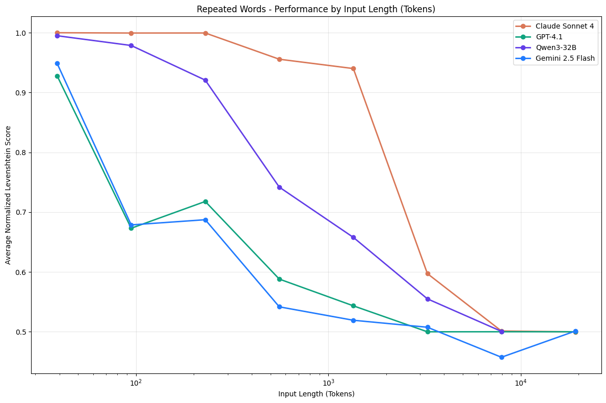

# Tarvos

> Run your AI coding plan to completion.

AI coding agents slow down as they go. The more context they accumulate, the worse their output gets — a well-known effect across every major model.

**Tarvos** solves this by running a chain of fresh agents on your plan, each one picking up exactly where the last left off. You write the plan once. Tarvos handles the rest.

Run multiple plans at once. Each session gets its own isolated git worktree. When the work is done, accept it to merge, or reject it to discard — without ever touching git yourself.

[](https://research.trychroma.com/context-rot)

---

## Quickstart

**Prerequisites:** [`claude`](https://docs.anthropic.com/en/docs/claude-code) CLI, `jq`, `bash`, [`bun`](https://bun.sh)

```bash
git clone https://github.com/anomalyco/tarvos.git
cd tarvos
./install.sh          # adds 'tarvos' to /usr/local/bin
cd tui && bun install # install the session browser UI
```

Then from your project:

```bash
tarvos init my-plan.md --name my-feature
tarvos begin my-feature
tarvos tui             # watch it work
```

---

## How it works

1. **Write a plan.** Describe what you want to build — phases, tasks, milestones. Any format works. See [`example.prd.md`](./example.prd.md) for inspiration.

2. **`tarvos init`** reads your plan, previews it, and creates a session — a named workspace with its own git branch and isolated working directory.

3. **`tarvos begin`** starts the agent in the background. It works through your plan one phase at a time, each fresh agent picking up from a handoff note left by the previous one.

4. **`tarvos tui`** opens the session browser where you can watch progress, view the activity log, and take action when work is done.

5. When done, **`tarvos accept`** merges the changes into your branch and cleans up. **`tarvos reject`** discards everything cleanly if you don't like the result.

---

## Commands

### `tarvos` / `tarvos tui`

Open the session browser. Run `tarvos` with no arguments or `tarvos tui`.

```
╭── Sessions ──────────────────────────────── 3 sessions ───╮
│                                                            │
│ ▶  ⠋ my-feature     running      tarvos/my-feature-…  2m ago │
│    ✓ bugfix-login   done         tarvos/bugfix-login-… 1h ago │
│    ○ experiment     initialized  —                     —      │
│                                                            │
╰────────────────────────────────────────────────────────────╯
[↑↓] Navigate  [Enter] Open/Actions  [s] Start  [a] Accept  [n] New  [q] Quit
```

Keys: `↑`/`k` up, `↓`/`j` down, `Enter` open or actions menu, `s` start, `a` accept, `r` reject, `n` new session, `R` refresh, `q` quit.

Actions menu (context-aware per session status):
- **running** → View, Stop
- **stopped** → Continue, Reject
- **done** → Accept, Reject, View Summary
- **initialized** → Start, Reject
- **failed** → Reject

---

### `tarvos init <plan.md> --name <name> [options]`

Read a plan file and create a named session.

| Option | Default | Description |
|---|---|---|
| `--name <name>` | required | Session name (alphanumeric + hyphens) |
| `--token-limit N` | `100000` | How much context an agent uses before handing off |
| `--max-loops N` | `50` | Maximum number of agent iterations |
| `--no-preview` | — | Skip the plan preview and create the session immediately |

---

### `tarvos begin <name>`

Start the agent loop for a session. Always runs in the background — use `tarvos tui` to monitor progress.

---

### `tarvos continue <name>`

Resume a stopped session from where it left off. No progress is lost.

---

### `tarvos accept <name>`

Merge a completed session's changes into your original branch and clean up. Session must have status `done`.

---

### `tarvos reject <name> [--force]`

Discard a session — deletes the branch and all its data. Use `--force` to skip the confirmation. Session must not be running.

---

### `tarvos stop <name>`

Stop a running session. Resume it later with `tarvos continue`.

---

## Session lifecycle

```
init → begin → [running] → done → accept (changes merged)
                                ↘ reject (changes discarded)
             → stopped → continue (resume)
                       ↘ reject  (discard)
```

---

## Where things live

Everything is under `.tarvos/` in your project (automatically gitignored):

- **`sessions/<name>/`** — session state, progress handoff notes, summary, logs
- **`worktrees/<name>/`** — the isolated working directory for each session (removed on accept/reject)
