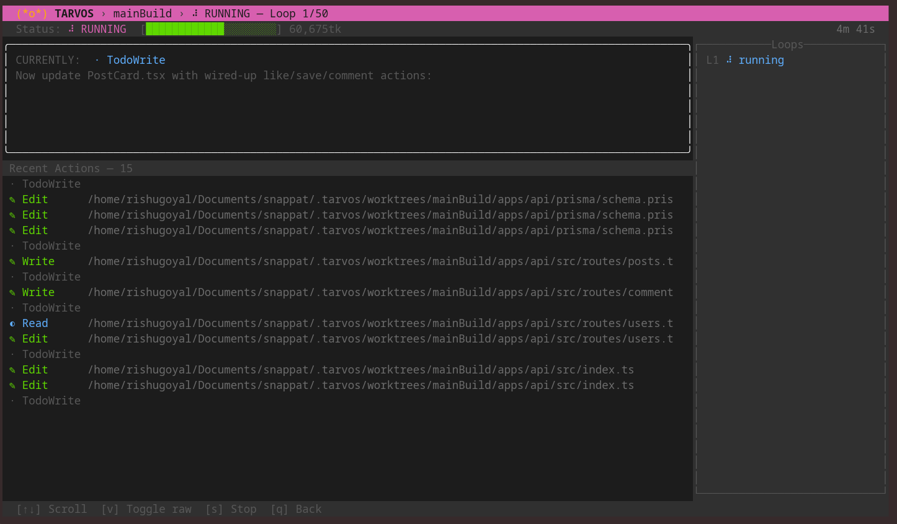

# Tarvos

[](https://github.com/Photon48/tarvos/actions/workflows/ci.yml)
[](LICENSE)

> Relay architecture for AI coding agents.

---

## The Problem

LLMs degrade as context fills up. This is measured, not anecdotal — model accuracy drops significantly as input length grows ([Chroma Research](https://research.trychroma.com/context-rot)). Every AI coding tool today runs a single agent from start to finish. By Phase 4 of your plan, half the context window is spent remembering what was already done. That is not autonomous development.

[](https://research.trychroma.com/context-rot)

---

## See It Work

```
$ tarvos init prds/payments-v2.md --name payments
  ✓ Plan loaded — 4 phases, ~2400 lines of work
  ✓ Session created on branch tarvos/payments-a1b2c3

$ tarvos begin payments

  Agent 1  Phase 1: Project scaffolding .............. ✓  (3m, 42k tokens)
           → wrote progress.md, handed off
  Agent 2  Phase 2: Stripe API integration ........... ✓  (8m, 87k tokens)
           → context budget hit at 87k, clean handoff
  Agent 3  Phase 2: Stripe API integration (cont.) ... ✓  (6m, 61k tokens)
           → wrote progress.md, handed off
  Agent 4  Phase 3: Webhook handlers + idempotency ... ✓  (7m, 79k tokens)
           → wrote progress.md, handed off
  Agent 5  Phase 4: Tests + error handling ........... ✓  (5m, 53k tokens)
           → ALL_PHASES_COMPLETE

  Done. 5 agents, 4 phases, 29 minutes. Each agent ran at full capacity.

$ tarvos accept payments
  ✓ Merged tarvos/payments-a1b2c3 → main
  ✓ Session archived
```

---

## Quickstart

**Prerequisites:** [`claude`](https://docs.anthropic.com/en/docs/claude-code) CLI. Tarvos currently implements Relay Architecture for Claude Code. Support for other agents is planned.

```bash
curl -fsSL https://raw.githubusercontent.com/Photon48/tarvos/main/install.sh | bash
```

From your project:

```bash
tarvos init my-plan.md --name my-feature
tarvos begin my-feature
tarvos tui
```



Use your AI coding tool's plan mode to write a phased development plan, save it to your project (e.g. `prds/my-feature.md`), and hand it to Tarvos. See [`example.prd.md`](./example.prd.md) for format reference.

---

## Relay Architecture

Relay Architecture replaces single-session execution with a relay of fresh agents. Each agent reads the full plan, picks up a minimal handoff from the previous agent, works at peak capacity, and passes the baton forward. The team covers a distance no single agent could sustain.

The architecture defines four components:

- **The Master Plan** — A phased development plan (PRD) that serves as the shared contract. Every agent reads it fresh from disk. It never accumulates in context — it survives every handoff as a file.

- **The Baton** — A deliberately minimal handoff note (`progress.md`), capped at 40 lines. What was done, what to do next, what gotchas exist. The constraint is the design: less information transfers better. A bloated handoff recreates context rot in the next agent.

- **The Signals** — Agents self-report through three trigger phrases: `PHASE_COMPLETE` (phase done, tests pass, committed), `PHASE_IN_PROGRESS` (stopping mid-phase at a clean breakpoint), `ALL_PHASES_COMPLETE` (entire plan verified done). The orchestrator listens for signals — it does not need to understand the code.

- **The Context Budget** — Token usage is tracked in real-time. When usage crosses the budget, the agent is stopped and a fresh one is spawned with a clean window and the baton. Agents also self-monitor: they prefer handing off cleanly over continuing into degraded output.

---

## How Tarvos Implements It

Tarvos is the reference implementation of Relay Architecture for Claude Code. It handles everything outside the agent's responsibility:

- **Git isolation** — Each session runs in its own git worktree. Multiple plans execute simultaneously without conflicts. Your working directory is never touched.
- **Background execution** — Agent loops run detached. Use `tarvos tui` to monitor.
- **Context monitoring** — Real-time token tracking via stream-json. Automatic handoff at budget threshold.
- **Signal detection** — Output stream scanned for trigger phrases. Orchestrator dispatches accordingly.
- **Recovery** — If an agent exits without writing `progress.md`, a recovery agent reconstructs the handoff from git history.
- **Accept / Reject** — Merge changes into your branch or discard them. No manual git required.

---

## Commands

| Command | Description |
|---|---|
| `tarvos init <plan.md> --name <name>` | Create a session from a plan. Options: `--token-limit N` (default 100k), `--max-loops N` (default 50), `--no-preview`. |
| `tarvos begin <name>` | Start the relay. Runs in background. |
| `tarvos tui` | Open the interactive session browser. |
| `tarvos stop <name>` | Stop a running session. |
| `tarvos continue <name>` | Resume a stopped session. No progress lost. |
| `tarvos accept <name>` | Merge completed session into your branch. Detects conflicts before merging. |
| `tarvos reject <name>` | Discard a session. Deletes branch and data. `--force` to skip confirmation. |
| `tarvos forget <name>` | Remove session from Tarvos, keep the git branch for manual handling. |
| `tarvos update` | Update to latest release. `--version v0.x.y` for specific version. |
| `tarvos migrate` | Upgrade from older config format. |

---

## Session Lifecycle

```
init → begin → [running] → done ──→ accept  (merged, archived)
                         │        ↘ reject  (discarded)
                         │        ↘ forget  (branch kept, archived)
                         ↓
                       failed ──→ reject / forget
                         ↓
                       stopped → continue / reject
```

Everything lives under `.tarvos/` in your project (gitignored): `sessions/` for state and logs, `worktrees/` for isolated working directories, `archive/` for completed sessions.

---

## Development

See [DEVELOPER.md](DEVELOPER.md) for the full guide.

```bash
git clone https://github.com/Photon48/tarvos.git && cd tarvos
tarvos-dev init my-plan.md --name test    # test shell changes — no build needed
cd tui && bun install && bun run build:darwin-arm64 && tarvos-dev tui   # build + test TUI
```

`tarvos-dev` is completely separate from production `tarvos`.
